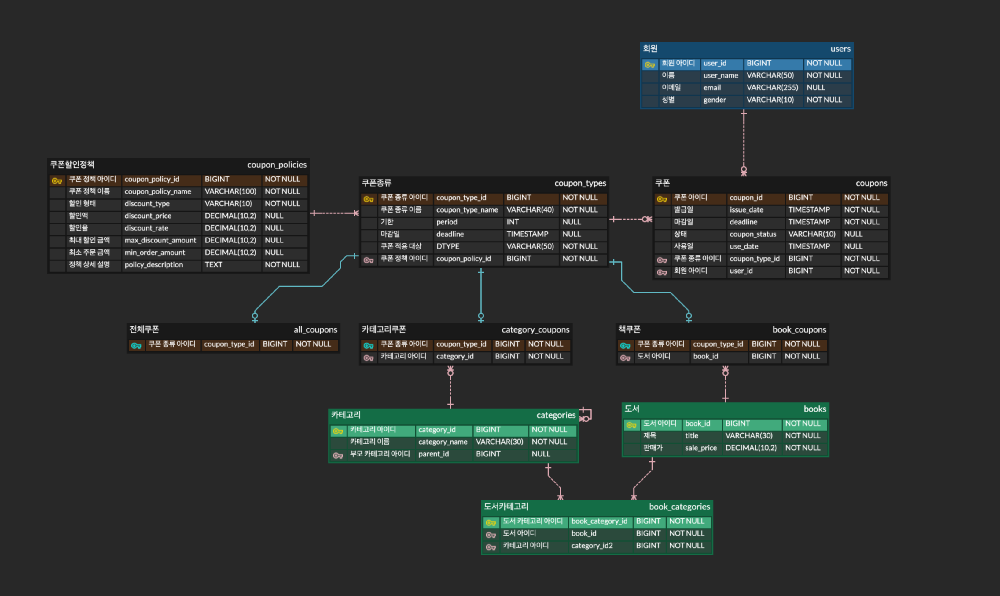

# 심심북스 쿠폰 서버

## 프로젝트 소개
본 프로젝트는 기존 심심북스 프로젝트의 쿠폰 기능을 분리하여 성능과 유지보수성을 개선하기 위해 시작되었습니다.

심심북스에서 제공하던 쿠폰 서비스에서 다음과 같은 사항을 중점적으로 개선하고자 합니다.
- Spring Data JPA 기반 코드를 순수 JPA로 전환
- 쿠폰 API 성능 측정 및 성능 최적화
- JPA N+1 문제 해결
- 쿠폰 발급 기능을 Message Queue로 전환 후 성능 비교

기존 심심북스 프로젝트에서 설정한 프로필과 당시의 개발 환경이 현재의 개발 환경과 맞지 않는 부분이 많았기 때문에 기존 프로젝트에서 쿠폰 서비스만 따로 분리하게 되었습니다.  
쿠폰 기능과 관련된 핵심 로직만 별도의 프로젝트로 분리하여 개발하였으며, 이 과정에서 회원 관리, 도서 관리, 카테고리 기능은 간소화하여 재구성했습니다.

## 심심북스 쿠폰 서버 ERD

기존 심심북스 프로젝트의 쿠폰 관련 테이블명을 조금 변경했습니다.   
### 변경 전   
- coupons   
    - 쿠폰을 적용하는 대상이 여러 유형으로 나뉜다는 점에서 coupon 이라고 지었습니다.
- coupons
  -  사용자가 실제로 사용하는 쿠폰 데이터를 담고 있으므로, user 엔티티가 coupon 엔티티를 참조하는 관점에서 테이블명을 coupons로 지정하였습니다.

### 변경 후   
- coupons --> coupons
  - 쿠폰 정책과 관련하여 쿠폰에 대한 전반적인 정보를 함께 관리하므로, 이를 명확하게 표현하기 위해 테이블명을 coupons로 변경하였습니다.
- coupons --> user_coupons
  - 이 테이블은 쿠폰 자체의 정보보다는 사용자가 발급받은 쿠폰 데이터를 저장하며, 쿠폰 테이블과 회원 테이블을 연결하는 역할을 수행하기 때문에, 테이블명을 coupons에서 user_coupons로 변경하였습니다.      

### 변경 이유 및 배경
기존에는 couponPolicy와 couponType이라는 용어가 중복된 느낌을 주어 혼란스러웠습니다.   
이를 개선하기 위해, 테이블명을 couponTypes에서 coupons로, coupons에서 user_coupons로 변경하였습니다.   
변경 후 coupons 테이블은 쿠폰에 대한 전반적인 정보를, user_coupons 테이블은 사용자가 발급받은 쿠폰 정보를 담아 각각의 역할을 보다 명확하게 나타내고자 했습니다.