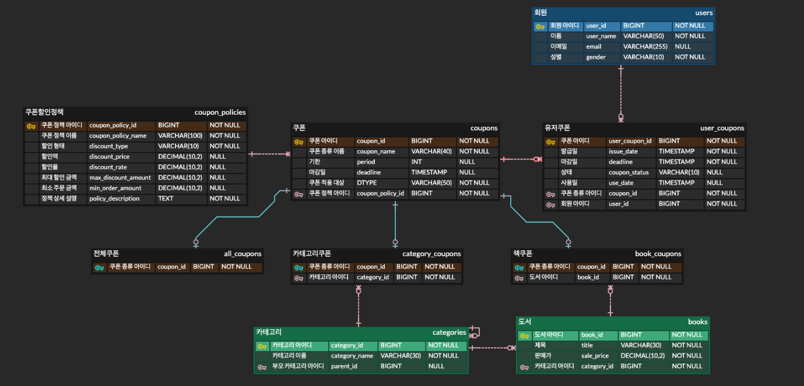

# 심심북스 쿠폰 서버

## 프로젝트 소개
본 프로젝트는 기존 심심북스 프로젝트의 쿠폰 기능을 분리하여 성능과 유지보수성을 개선하기 위해 시작되었습니다.

심심북스에서 제공하던 쿠폰 서비스에서 다음과 같은 사항을 중점적으로 개선하고자 합니다.
- Spring Data JPA 기반 코드를 순수 JPA로 전환
- 쿠폰 API 성능 측정 및 성능 최적화
- JPA N+1 문제 해결
- 쿠폰 발급 기능을 Message Queue로 전환 후 성능 비교

기존 프로젝트에서 쿠폰 서비스만 따로 분리하게 된 이유는 기존 심심북스 프로젝트에서 설정한 프로필과 당시의 개발 환경이 현재의 개발 환경과 맞지 않는 부분이 많았기 때문입니다.   
따라서 쿠폰 기능과 관련된 핵심 로직만 별도의 프로젝트로 분리하여 개발하였으며, 이 과정에서 회원 관리, 도서 관리, 카테고리 기능은 간소화하여 재구성했습니다.

## 심심북스 쿠폰 서버 ERD

